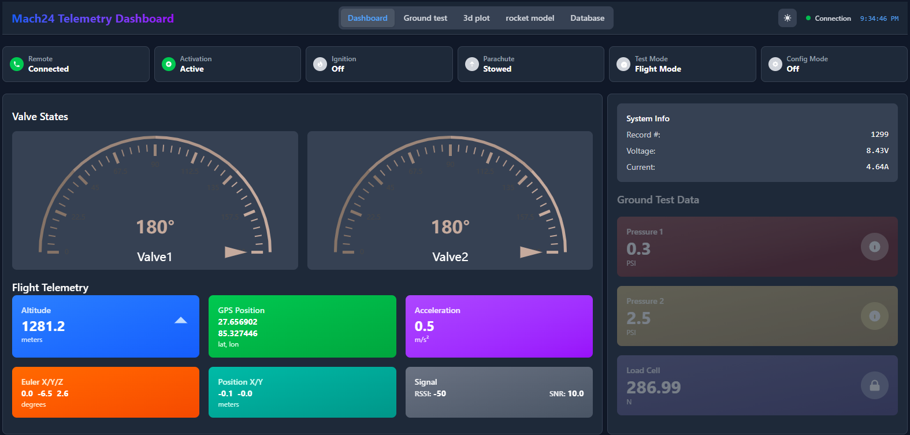
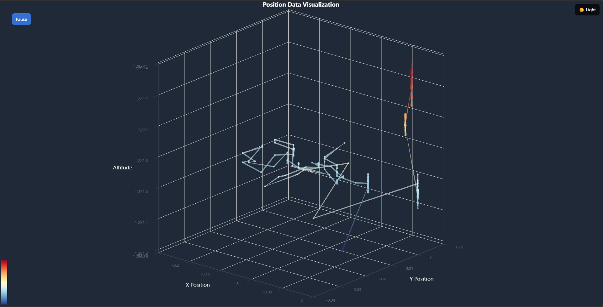
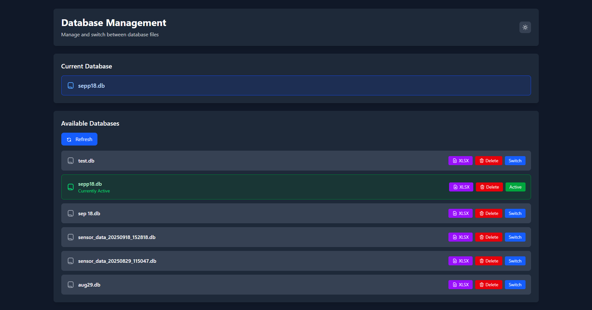
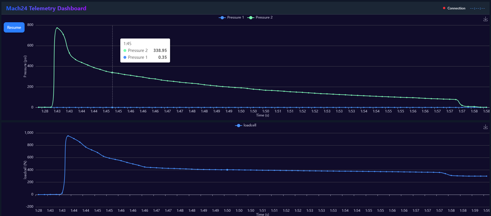
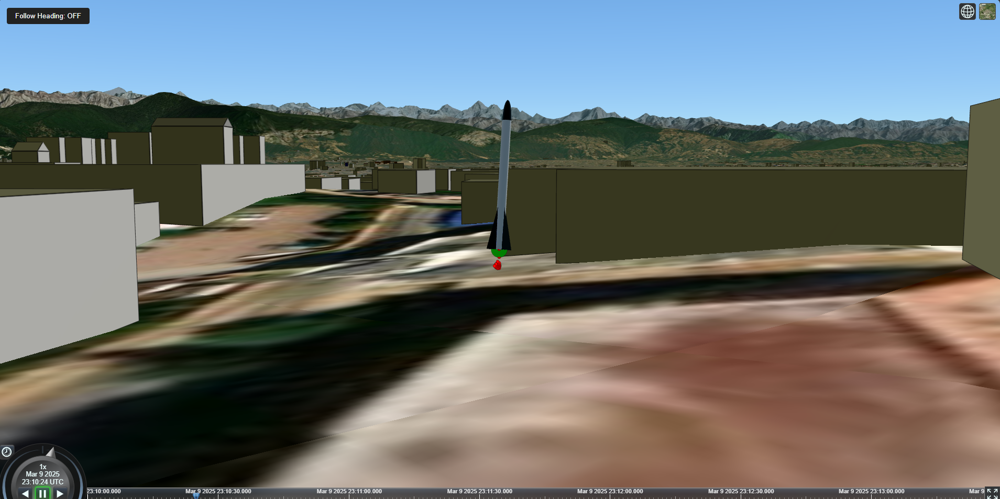

# Mach24 - Real-time Sensor Data Acquisition & Visualization System


A comprehensive Flask-based web application designed for real-time sensor data acquisition, storage, and visualization. The system supports both serial and wireless data communication modes, stores telemetry data in MySQL/SQLite databases, and provides interactive dashboards for monitoring and analysis.

## 🚀 Features

- **Real-time Data Acquisition**: Collect sensor data via serial communication (USB/UART) or wireless transmission
- **Dual Communication Modes**: 
  - Serial mode for wired connections
  - Wireless mode for remote data transmission
- **Database Management**: 
  - MySQL/SQLite database support
  - Create new databases or load existing ones
  - Export and manage sensor data records
- **Interactive Dashboards**: Multiple visualization interfaces including:
  - Real-time telemetry monitoring
  - 3D position tracking with Cesium.js
  - Ground test data visualization
  - Live data streaming with WebSocket support
- **Coordinate System**: Local XY to Lat/Lon conversion using transverse mercator projection
- **Web-based Interface**: Modern, responsive UI built with Bootstrap and Tailwind CSS
- **SocketIO Integration**: Real-time bidirectional communication between client and server

## � Download

### Standalone Executable (Windows)
**Don't want to set up Python?** Download the pre-built executable version:

**[⬇️ Download Mach24 Server v1.2 (ZIP)](https://github.com/sriza-n/mach24_flask_new/releases/download/v1.2/mach24-server.zip)**

- **No Python installation required**
- **No dependencies to install**
- **Just extract and run**
- Includes all necessary files and libraries
- Perfect for quick deployment and testing

**How to use:**
1. Download and extract the ZIP file
2. Run `mach24-server.exe`
3. Follow the setup wizard
4. Access the application at `http://localhost:5000`

For the latest releases and changelog, visit the [Releases page](https://github.com/sriza-n/mach24_flask_new/releases).

## �📸 Screenshots

<div align="center">

### Dashboard View


### 3D Visualization


### Database Management


### Ground Test Graph


### 3D Rocket Model


</div>

## 📁 Project Structure

```
mach24_flask_new/
│
├── main.py                          # Application entry point
├── .gitignore                       # Git ignore configuration
│
├── app/                             # Core application package
│   ├── __init__.py                  # Flask app factory and initialization
│   ├── models.py                    # SQLAlchemy database models (SensorData, SensorData0, SwitchState)
│   ├── socketio_events.py           # WebSocket event handlers
│   │
│   ├── routes/                      # Route handlers (Blueprint-based)
│   │   ├── __init__.py
│   │   ├── main_routes.py           # Main page routes (home, dashboard, visualizations)
│   │   ├── api_routes.py            # REST API endpoints for data and serial control
│   │   └── database_routes.py       # Database management endpoints
│   │
│   ├── services/                    # Business logic layer
│   │   ├── __init__.py
│   │   ├── serial_service.py        # Serial communication handler (PySerial)
│   │   └── database_service.py      # Database operations and management
│   │
│   └── utils/                       # Utility functions
│       ├── __init__.py
│       ├── coordinates.py           # XY to Lat/Lon coordinate transformations
│       ├── error_handling.py        # Error handling decorators and utilities
│       └── setup.py                 # Initial setup and configuration helpers
│
├── static/                          # Static assets (served by Flask)
│   ├── assets/                      # Images, videos, and 3D models
│   │   ├── mach24.png               # Application logo
│   │   ├── rocket.glb               # 3D rocket model (glTF format)
│   │   ├── loading.mp4              # Loading animation
│   │   ├── mach24.riv               # Rive animation files
│   │   └── *.png                    # Status icons (ready, clear, fly, off)
│   │
│   ├── js/                          # JavaScript files
│   │   ├── script.js                # Main application scripts
│   │   ├── dash5.js                 # Dashboard 5 (Cesium 3D visualization)
│   │   ├── telemetry-data.js        # Telemetry data handling
│   │   └── visualize.js             # Data visualization scripts
│   │
│   └── lib/                         # Third-party libraries
│       ├── socket.io.min.js         # SocketIO client library
│       ├── echarts.min.js           # Apache ECharts for charts
│       ├── echarts-gl.min.js        # ECharts 3D GL extension
│       ├── three.r134.min.js        # Three.js 3D library
│       ├── rive.js                  # Rive animation runtime
│       ├── vanta.clouds.min.js      # Vanta.js animated backgrounds
│       └── tailwind*.css            # Tailwind CSS framework
│
├── templates/                       # Jinja2 HTML templates
│   ├── index.html                   # Main landing page
│   ├── home.html                    # Home dashboard
│   ├── homescreen.html              # Alternative home screen
│   ├── about.html                   # About page
│   ├── database.html                # Database management interface
│   ├── dash1.html                   # Dashboard variant 1
│   ├── dash2.html                   # Dashboard variant 2
│   ├── dash3.html                   # Dashboard variant 3
│   ├── dash4.html                   # Dashboard variant 4
│   ├── dash5.html                   # Dashboard variant 5 (Cesium 3D map)
│   ├── loading.html                 # Loading screen
│   ├── loading1.html                # Alternative loading screen
│   └── websocket.html               # WebSocket test page
│
├── screenshots/                     # Application screenshots for documentation
│   ├── dashboard.png
│   ├── 3dplot.png
│   ├── database_management.png
│   ├── groundtest_graph.png
│   └── rocketmodel_3d.png
│
└── database/                        # SQLite database files (created at runtime)
    └── sensor_data_*.db             # Timestamped database files
```

## 🏗️ Architecture

### Application Components

#### **1. Main Entry Point (`main.py`)**
- Initializes the Flask application using factory pattern
- Configures eventlet for async operations
- Handles initial setup wizard for data acquisition mode and database selection
- Launches the web server and optionally opens browser

#### **2. Core Application (`app/__init__.py`)**
- Creates Flask app instance with proper configuration
- Initializes SQLAlchemy (database ORM)
- Configures Flask-SocketIO for WebSocket support
- Sets up CORS for cross-origin requests
- Registers blueprints for modular routing

#### **3. Database Models (`app/models.py`)**

**SensorData** - Main telemetry table (when ST=1)
```python
- Timestamp fields: date, time, teensytime, record_sn
- Power: voltage, current
- System states: remote_st, valve_1, valve_2, activ_st, igni_st, para_st
- Position: x_pos, y_pos, alt, eu_x, eu_y, eu_z
- Acceleration: acc
- GPS: lat, lon, fused_lat, fused_lon
- Communication: rssi, snr
- Sensors: p1, p2, load
- Servos: servo1_angle, servo2_angle
- Configuration: config_mode, test_mode, connection_state
```

**SensorData0** - Alternative data format (when ST=0)

**SwitchState** - System switch/state tracking

#### **4. Services Layer**

**Serial Service (`app/services/serial_service.py`)**
- Auto-detects available COM ports
- Establishes serial connection with configurable baud rate
- Parses incoming sensor data packets
- Stores data to database in real-time
- Broadcasts updates via WebSocket
- Supports bidirectional communication (send commands)
- Handles coordinate transformations (XY → Lat/Lon)

**Database Service (`app/services/database_service.py`)**
- Manages multiple SQLite database files
- Creates timestamped database files
- Lists and switches between existing databases
- Executes CRUD operations
- Exports data to various formats

#### **5. Routes**

**Main Routes (`app/routes/main_routes.py`)**
- Serves HTML templates
- Dashboard pages (dash1-dash5)
- Visualization pages
- Video streaming endpoint

**API Routes (`app/routes/api_routes.py`)**
- `/serial_status` - Get serial connection status
- `/start_serial` - Initiate serial connection
- `/stop_serial` - Close serial connection
- `/latest_data` - Get latest sensor reading
- `/latest_sw` - Get latest switch state
- `/origin_coordinates` - Manage origin coordinates for coordinate transformation

**Database Routes (`app/routes/database_routes.py`)**
- `/list_databases` - List all available databases
- `/switch_database` - Switch to different database
- `/export_data` - Export database contents
- `/query_data` - Custom data queries

#### **6. SocketIO Events (`app/socketio_events.py`)**
- `connect` - Client connection handler
- `disconnect` - Client disconnection handler
- `get_sensor_data` - Request latest sensor data
- `start_data_stream` - Begin real-time data streaming
- Real-time bidirectional communication

#### **7. Utilities**

**Coordinates (`app/utils/coordinates.py`)**
- Converts local XY meters to WGS84 Lat/Lon
- Uses transverse mercator projection
- Supports altitude/elevation conversion

**Error Handling (`app/utils/error_handling.py`)**
- Centralized exception handling
- Connection error decorators
- Logging utilities

**Setup (`app/utils/setup.py`)**
- Interactive setup wizard
- Banner display
- Configuration summary
- Browser auto-launch

## 🔧 Technical Stack

### Backend
- **Flask** - Web framework
- **Flask-SQLAlchemy** - ORM for database operations
- **Flask-SocketIO** - WebSocket support
- **Flask-CORS** - Cross-Origin Resource Sharing
- **eventlet** - Async/concurrent operations
- **PySerial** - Serial communication
- **pyproj** - Coordinate transformations

### Frontend
- **HTML5/CSS3** - Structure and styling
- **JavaScript (ES6+)** - Client-side logic
- **Bootstrap 5** - Responsive UI framework
- **Tailwind CSS** - Utility-first CSS framework
- **Socket.IO Client** - WebSocket client
- **Apache ECharts** - Data visualization charts
- **ECharts GL** - 3D data visualization
- **Three.js** - 3D graphics rendering
- **Cesium.js** - 3D geospatial visualization
- **Rive** - Interactive animations
- **Vanta.js** - Animated backgrounds

### Database
- **SQLite** - Default database (file-based)
- **MySQL** - Optional (for production deployments)

## 📦 Installation

### Prerequisites
- Python 3.8 or higher
- pip (Python package manager)
- Serial port drivers (for serial communication)


6. **Follow the setup wizard**
- Select data acquisition mode (Serial/Wireless)
- Choose to create new database or use existing one
- For serial mode: select COM port and baud rate

7. **Access the application**
- Open browser to `http://localhost:5000`
- Application will auto-launch if configured

## 🎮 Usage

### Starting the Application

1. Run `python main.py`
2. Complete the interactive setup:
   - **Data Acquisition Mode**: Choose between Serial or Wireless
   - **Database Selection**: Create new or select existing database
   - **Serial Configuration** (if applicable): Select COM port and baud rate

3. The server will start and optionally open your default browser

### Serial Communication

**Data Packet Format:**
The system expects comma-separated values in the following format:
```
ST,date,time,teensytime,record_sn,voltage,current,remote_st,valve_1,valve_2,
activ_st,igni_st,para_st,x_pos,y_pos,alt,eu_x,eu_y,eu_z,acc,lat,lon,
fused_lat,fused_lon,rssi,snr,p1,p2,load,servo1_angle,servo2_angle,
config_mode,test_mode,connection_state
```

### Dashboard Features

- **Real-time Monitoring**: Live sensor data updates via WebSocket
- **3D Visualization**: Interactive 3D position tracking
- **Historical Data**: Query and visualize past data
- **Database Management**: Switch between databases, export data
- **Ground Testing**: Specialized view for ground test analysis

```

### Serial Configuration
- **Baud Rate**: Configurable during setup (default: 115200)
- **Data Bits**: 8
- **Parity**: None
- **Stop Bits**: 1
- **Flow Control**: None

### Server Configuration
- **Host**: 0.0.0.0 (accessible on network)
- **Port**: 5000
- **Debug Mode**: Configurable in main.py
- **WebSocket**: Enabled via Flask-SocketIO

## 🧪 Development

### Project Organization
The project follows a modular architecture:

- **Blueprints**: Routes are organized as Flask Blueprints for modularity
- **Service Layer**: Business logic separated from route handlers
- **Models**: Database models using SQLAlchemy ORM
- **Utilities**: Reusable helper functions
- **Templates**: Jinja2 templates with template inheritance


